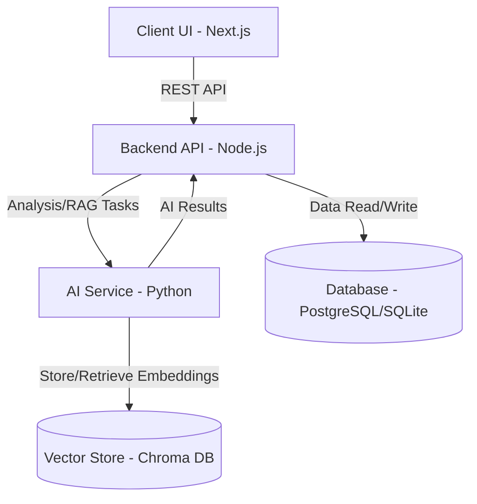
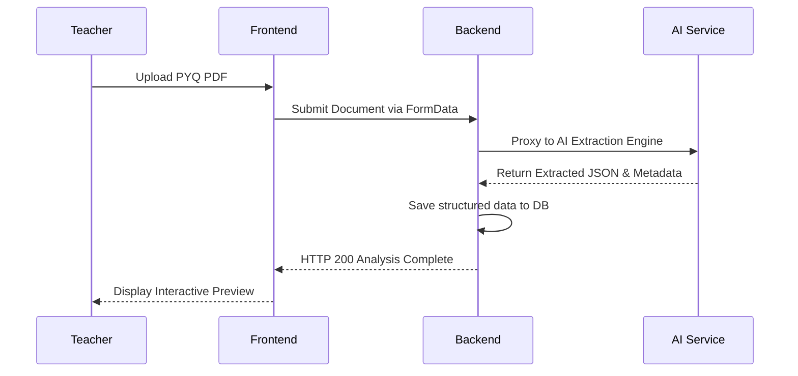

<div align="center">
  <br />
  <h1>🚀 MALPHOR (formerly CampusMind)</h1>
  <p>
    <strong>A next-generation AI-powered educational platform designed to elevate the academic experience for both students and educators.</strong>
  </p>
  <p>
    
    
    
    
    
  </p>
</div>

<hr />

## 🌟 Overview

MALPHOR is an advanced educational ecosystem that bridges the gap between raw institutional data and actionable learning insights. By leveraging local Large Language Models (LLMs) and Vector Databases, MALPHOR provides tools such as an intelligent **Previous Year Question (PYQ) Analyzer**, an institutional **AI Chat Assistant (Campus GPT)**, and highly interactive, data-driven dashboards.

> **Data Integrity Policy:** MALPHOR strictly operates on a real-data philosophy. Analytics, AI responses, and charts represent true database state, utilizing genuine RAG (Retrieval-Augmented Generation) without fabricating statistics or placeholder knowledge.

---

## ✨ Core Features

*   🧠 **Intelligent PYQ Analyzer:** Automates the extraction, segmentation, and semantic analysis of exam papers. Detects recurring concepts, tracks topic weightage over time, and highlights high-frequency questions.
*   💬 **Campus GPT (RAG):** A context-aware chat assistant that securely retrieves and synthesizes answers directly from institutional documents, syllabi, and administrative resources using Chroma DB.
*   📊 **Interactive Dashboards:** Role-based, visually stunning interfaces for Teachers and Students to track progress, assignments, and analytics.
*   🔒 **Local AI Processing:** Configured to utilize local models (like `qwen2.5:3b` via Ollama) and lightweight Python services for privacy-preserving, lightning-fast inference.

---

## 🏗️ Architecture

MALPHOR follows a microservices-style architecture, decoupled for scalability and rapid iteration.

### Tech Stack
*   **Frontend:** Next.js 14 (React), Tailwind CSS, Framer Motion
*   **Backend API:** Node.js, Express.js, Prisma ORM, PostgreSQL/SQLite
*   **AI Service:** Python, FastAPI, PyMuPDF, ChromaDB, Ollama, Groq

### System Flowchart



### PYQ Analysis Pipeline



---

## 🚀 Getting Started

Follow these steps to get the MALPHOR environment running on your local machine.

### Prerequisites

Ensure you have the following installed:
*   [Node.js](https://nodejs.org/) (v18 or higher)
*   [Python](https://www.python.org/) (v3.9 or higher)
*   [Ollama](https://ollama.ai/) (For local LLM inference)

### 1. Installation

Clone the repository and install all frontend and backend dependencies using the root shortcut:

```bash
git clone https://github.com/deepanshu83/mlfor.git
cd mlfor
npm run install:all
```

Set up the Python environment for the AI Service:

```bash
cd ai-service
pip install -r requirements.txt
```

### 2. Environment Variables

Navigate to each service directory and configure the environment files. Copy the `.env.example` to `.env` in the following directories and fill in the required keys:

*   `backend/.env` (Database URL, JWT Secret, Cloudinary Keys)
*   `frontend/.env.local` (API URLs)
*   `ai-service/.env` (Ollama configuration, API keys)

### 3. Model Setup

Pull the required local language model for extraction tasks:

```bash
ollama pull qwen2.5:3b
```

### 4. Running the Stack

You can launch the entire stack (Frontend, Backend, and AI Service) simultaneously with a single command from the root directory:

```bash
npm run dev
```

*The application will be available at [http://localhost:3000](http://localhost:3000)*

---

## 📂 Directory Structure

```text
mlfor/
├── frontend/             # Next.js Application (UI)
│   ├── src/app/          # App Router Pages & Layouts
│   └── src/components/   # Reusable UI Components
├── backend/              # Node.js API Service
│   ├── src/routes/       # Express Route Handlers
│   ├── src/controllers/  # Business Logic
│   └── prisma/           # Database Schema & Migrations
├── ai-service/           # Python AI Engine
│   ├── main.py           # FastAPI Application Entry
│   ├── services/         # Extraction & RAG Logic
│   └── requirements.txt  # Python Dependencies
└── package.json          # Root scripts and workspace config
```

---

## 🤝 Contributing

Contributions are what make the open-source community such an amazing place to learn, inspire, and create. Any contributions you make are **greatly appreciated**.

1. Fork the Project
2. Create your Feature Branch (`git checkout -b feature/AmazingFeature`)
3. Commit your Changes (`git commit -m 'Add some AmazingFeature'`)
4. Push to the Branch (`git push origin feature/AmazingFeature`)
5. Open a Pull Request

---

<div align="center">
  <p>Built with ❤️ by the Debug Thugs Team.</p>
</div>
